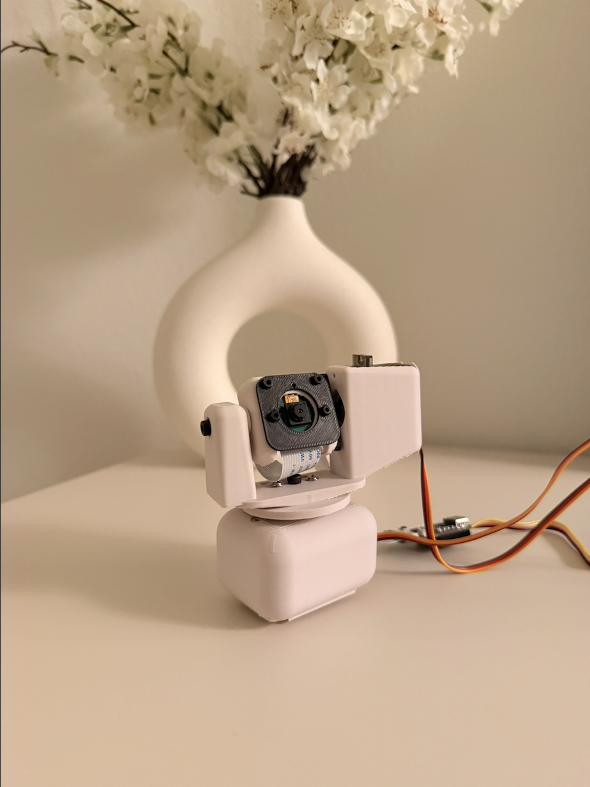
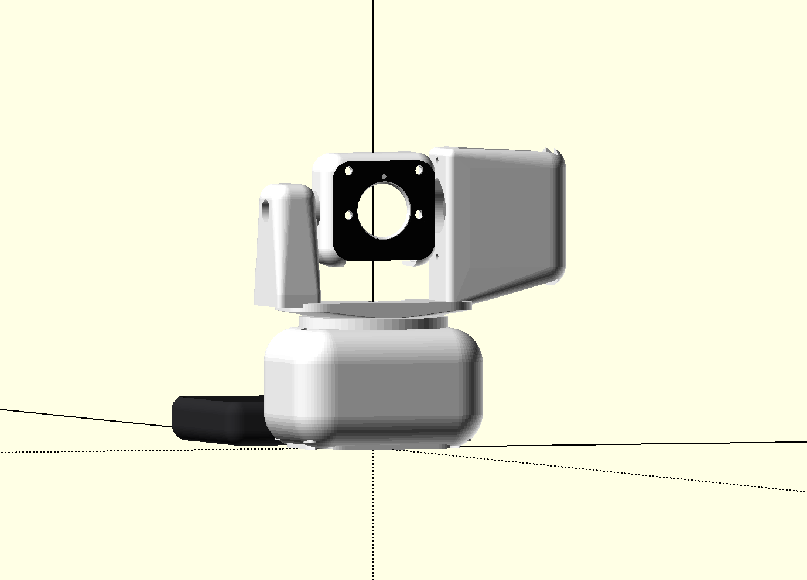
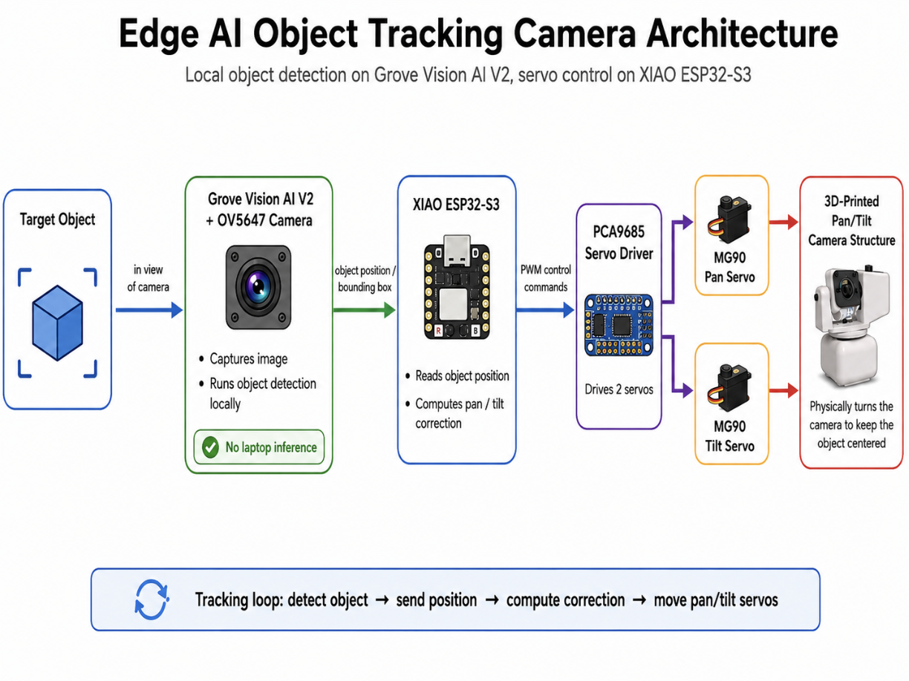
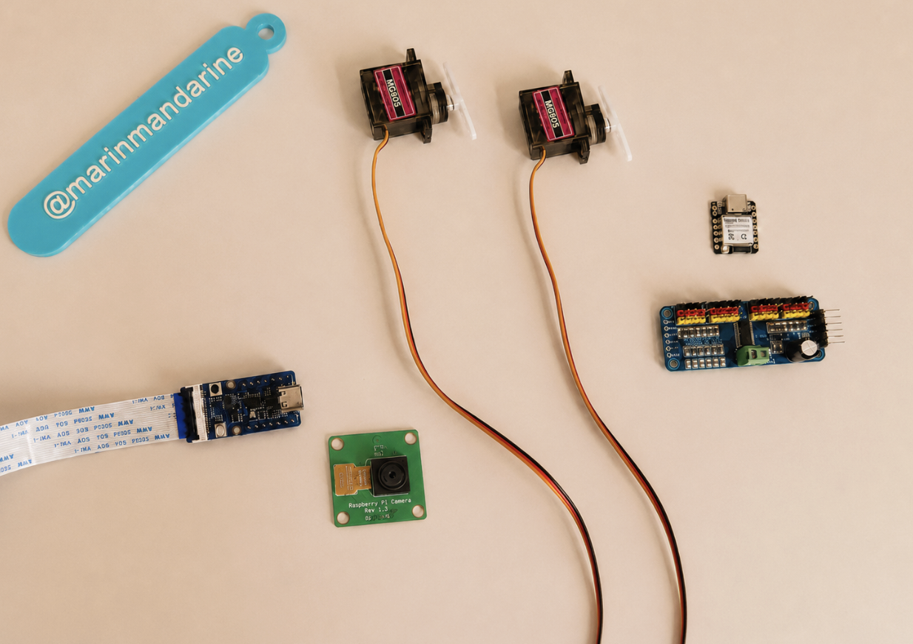
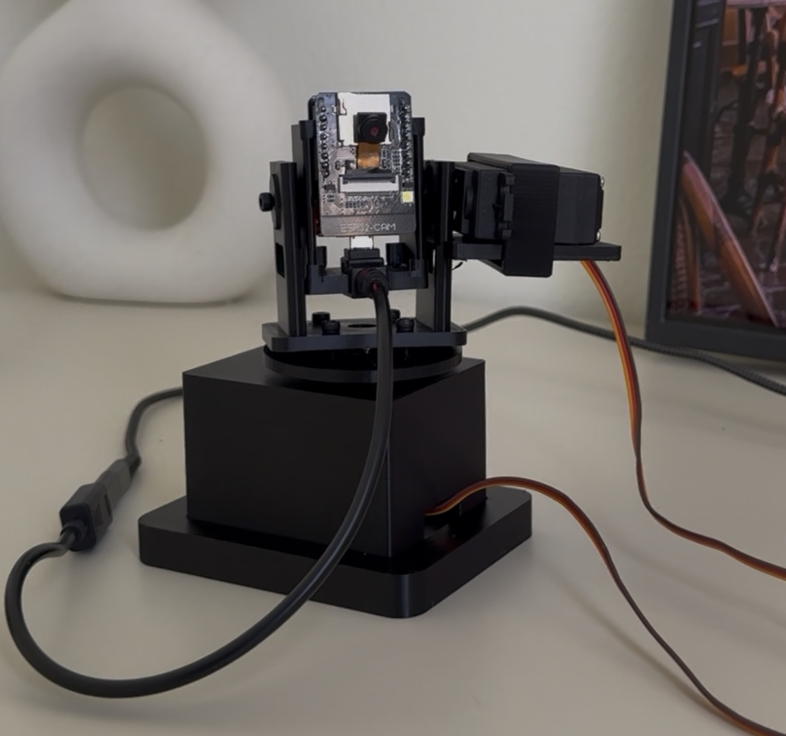

# Local Edge AI Object-Tracking Camera



## Why I Rebuilt It

My first object-tracking camera used an ESP32-CAM to stream video to my laptop. A YOLO model running on the laptop detected the object, and the laptop sent movement commands to another ESP32 controlling the servos.

It worked, but the camera could not track anything without my laptop.

In this upgraded version, object detection runs locally on Grove Vision AI V2. The detected object position is sent to a XIAO ESP32-S3, which controls the pan and tilt servos.

I also redesigned the 3D-printed camera body to fit the new hardware.



## How It Works



1. Grove Vision AI V2 detects the object.
2. It sends the object's position to the XIAO.
3. The XIAO compares that position with the center of the camera frame.
4. If the object is off-center, the XIAO moves the pan and tilt servos.
5. The camera turns toward the object.

Object detection and servo control now run locally on the device.

## Demo


The upgraded prototype can now detect an object, decide where to move, and physically follow it without relying on a laptop.

## Hardware

- Grove Vision AI V2 Kit
- XIAO ESP32-S3
- OV5647-62 FOV camera module
- 2 × MG90S metal gear micro servos
- PCA9685 servo driver
- External 5 V servo power supply
- Custom 3D-printed pan/tilt structure
- Jumper wires and mounting hardware



## Servo Control

The XIAO checks how far the object is from the center of the frame:

```cpp
errorX = objectCenterX - frameCenterX;
errorY = objectCenterY - frameCenterY;
```

The error is converted into a target servo speed:

```cpp
panSpeed  = clamp(KpPan * errorX, -maxPanSpeed, maxPanSpeed);
tiltSpeed = clamp(KpTilt * errorY, -maxTiltSpeed, maxTiltSpeed);
```

If the object is far from the center, the camera moves faster. If it is only slightly off-center, it moves more slowly.

A dead zone prevents tiny movements when the object is already close to the center. Acceleration limits make the speed change gradually instead of jumping instantly.

Accurate detection alone is not enough. Smooth and stable servo control is also important for reliable tracking.

## Wiring

See [`docs/wiring.md`](docs/wiring.md).

The servos use an external 5 V power supply. The external power ground and XIAO ground must be connected together.

## Software

### Required Arduino Libraries

- Seeed Arduino SSCMA
- Adafruit PWM Servo Driver Library

### Uploading the Firmware

1. Install the required libraries in Arduino IDE.
2. Open:
   `firmware/grove_vision_ai_object_tracker/grove_vision_ai_object_tracker.ino`
3. Select the XIAO ESP32-S3 board and the correct port.
4. Upload the sketch.
5. Open Serial Monitor at `115200` baud.
6. A successful start should print:

```text
AI BEGIN OK
```

### Tracking Settings

The most important values are grouped near the beginning of the sketch:

- Servo center positions
- Mechanical movement limits
- Servo directions
- Proportional gains
- Maximum speed
- Acceleration
- Dead-zone sizes
- Detection smoothing

These values may need small adjustments for a different pan/tilt structure.

## Original Version vs. Upgraded Version

### Original Version



The original version streamed video to my laptop, where a YOLO model detected the object.

### Upgraded Version

The upgraded version runs object detection locally on Grove Vision AI V2.

| Feature | Original Version | Upgraded Version |
| --- | --- | --- |
| Camera system | ESP32-CAM | Grove Vision AI V2 + OV5647 camera |
| AI inference | Laptop | Grove Vision AI V2 |
| Servo control | Second ESP32 | XIAO ESP32-S3 + PCA9685 |
| Servos | MG995/MG996-style servos | MG90S servos |
| Tracking loop | Laptop YOLO + serial commands | Local detection + servo control |
| Portability | Limited | More compact |
| Main limitation | Required laptop inference | Still needs a cleaner enclosure and power system |

The biggest upgrade is not only the hardware. It is the architecture. Moving object detection onto the embedded vision module brings the project much closer to a standalone edge AI camera.

## Project Structure

```text
edge-ai-object-tracking-camera/
├── firmware/
│   └── grove_vision_ai_object_tracker/
│       └── grove_vision_ai_object_tracker.ino
├── docs/
│   └── wiring.md
├── images/
│   ├── cad-assembly.png
│   ├── hardware.jpg
│   ├── original-camera.jpg
│   ├── system-diagram.png
│   ├── tracking-demo.gif
│   ├── upgraded-camera.jpg
│   └── README.md
├── cad/
│   ├── source/
│   │   └── object_tracking_camera.scad
│   ├── stl/
│   │   ├── base.stl
│   │   ├── base_cover.stl
│   │   ├── yoke.stl
│   │   ├── camera_head.stl
│   │   └── faceplate_insert.stl
│   └── README.md
├── .gitignore
├── LICENSE
└── README.md
```

## What I Want to Improve Next

- Cleaner wiring
- A better electronics enclosure
- Battery power and power management
- Smoother servo movement
- Better mechanical balance
- More latency and response-time testing
- A larger and more varied training dataset

One future idea is to turn this into a small nature or wildlife monitoring camera. That would require a stronger enclosure, reliable power, and environmental protection.

## Current Status

This is still a prototype, but the main local edge AI tracking loop is working.

The camera can now:

- Detect the object locally
- Send its position to the XIAO
- Move the pan and tilt servos
- Follow the object without a laptop

## License

This project is available under the MIT License.
